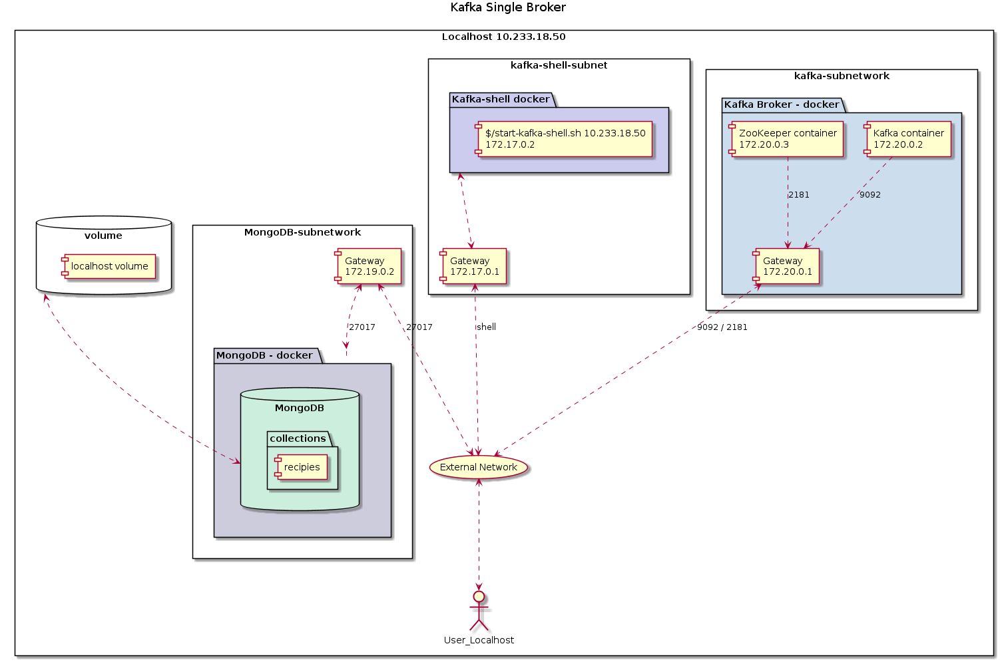

# Running Kafka on Docker Containers

## Architecture of the solution - Kafka with only one node



#### STEP 1: Initialize Kafka/Zookeeper Containers 

Command: `docker-compose -f docker-compose-single-broker.yml up -d`


This is the content of the file docker-compose.yml that we are going to use.  Verify
that the value of KAFKA_ADVERTISED_HOST_NAME corresponds to the IP address assigned to `en0`.
On Mac, use the command `ipconfig getifaddr en0`, that returns the IP address (e.g. for me 
10.233.18.50).  Edit the yaml file and update the value of the variable:

```yaml
$ cat docker-compose-single-broker.yml
# Docker-compose file for a single-broker
version: '2'
services:
  zookeeper:
    image: wurstmeister/zookeeper
    ports:
      - "2181:2181"
    expose:
      - "2181"
  kafka:
    build: .
    ports:
      - "9092:9092"
    expose:
      - "9092"
    environment:
      KAFKA_ADVERTISED_HOST_NAME: 10.233.18.50
      # KAFKA_ADVERTISED_HOST_NAME: 192.168.99.100
      # KAFKA_CREATE_TOPICS: "test:1:1"
      KAFKA_ZOOKEEPER_CONNECT: zookeeper:2181
    volumes:
      - /var/run/docker.sock:/var/run/docker.sock

```

#### STEP 2: Initiate container with Kafka Shell to interact with the broker
In this step we are going to connect a container running a Kafka image, and from there,
we are going to create a topic to be used for writing from an app.

```bash
# Notice that the IP address is the value of KAFKA_ADVERTISED_HOST_NAME 
./start-kafka-shell.sh 10.232.36.22 

# In a new shell - create the topic "oztest" with 4 partitions 
bash-4.4# kafka-topics.sh --create --topic oztest --partitions 4 --replication-factor 1 --bootstrap-server `broker-list.sh`

# Para borrar un topico
bash-4.4# kafka-topics.sh --delete --topic test --bootstrap-server `broker-list.sh`

# Descripcion de un topico
bash-4.4# kafka-topics.sh --describe --topic ozsample --bootstrap-server=`broker-list.sh`

Topic: ozsample	PartitionCount: 1	ReplicationFactor: 1	Configs: segment.bytes=1073741824
	Topic: ozsample	Partition: 0	Leader: 1005	Replicas: 1005	Isr: 1005

```

### STEP 3: Sending messages (from Python app) using the Kafka library
From a terminal on "localhost" create an app that sends messages to the topic created on STEP 2

```python

# Programa: example-producer.py
#

from kafka import KafkaProducer
import time

mykafkaserver="localhost:9092"
mytopic="ozsample"

try:
   producer = KafkaProducer(bootstrap_servers=mykafkaserver)
except Exception as e:
   print ("Error conectandose a Kafka")
   print (e)

mymessage = ['Bienvenido','a Kafka','una aventura','en el manejo','de eventos']

key=1001
for m in mymessage:
    key = key + 1
    mkey = 'message-'+str(key)
    print ("sending ",mkey," = ",m)
    # message encoded to ensure valid unicode as expected by Kafka
    key_bytes = bytes(mkey, encoding='utf-8')
    value_bytes = bytes(m, encoding='utf-8')
    producer.send(mytopic, key=key_bytes, value=value_bytes)
    producer.flush()
    # delay introduced just for illustration purposes (not needed by Kakfa)
    time.sleep(1)

```

The output of executing the application should be something along the lines of...

```bash
# Program execution
$ python example-producer.py

sending  message-1002  =  Bienvenido
sending  message-1003  =  a Kafka
sending  message-1004  =  una aventura
sending  message-1005  =  en el manejo
sending  message-1006  =  de eventos

```
### STEP 4: Read messages published to Kafka from Localhost
Next step, we are going to read the messages, from the "ozsample" topic.  For this example,
we write a program with Python and execute it from our term (on localhost).

```python

# Programa Example-consumer.py
from kafka import KafkaConsumer

parsed_topic_name='oztest1'
try:
   consumer = KafkaConsumer(parsed_topic_name, auto_offset_reset='earliest',
                  bootstrap_servers=['localhost:9092'], api_version=(0, 10), consumer_timeout_ms=5000)
except Exception as e:
    print ("Error conectandose a Kafka")
    print (e)

# show messages and extracts content
for message in consumer:
    print(message)
    # decodifica
    msg = bytes.decode(message.value)
    print("content: ", msg)

```
The execution of this program should produce results similiar to..:

```
# from a terminal on localhost


$ python example-consumer.py

ConsumerRecord(topic='oztest1', partition=0, offset=0, timestamp=1585103975358, timestamp_type=0, key=b'message-1006', value=b'de eventos', headers=[], checksum=2371263753, serialized_key_size=12, serialized_value_size=10, serialized_header_size=-1)
content:  de eventos

ConsumerRecord(topic='oztest1', partition=1, offset=0, timestamp=1585103971232, timestamp_type=0, key=b'message-1002', value=b'Bienvenido', headers=[], checksum=2170847914, serialized_key_size=12, serialized_value_size=10, serialized_header_size=-1)
content:  Bienvenido

ConsumerRecord(topic='oztest1', partition=1, offset=1, timestamp=1585103972253, timestamp_type=0, key=b'message-1003', value=b'a Kafka', headers=[], checksum=3311813990, serialized_key_size=12, serialized_value_size=7, serialized_header_size=-1)
content:  a Kafka

ConsumerRecord(topic='oztest1', partition=3, offset=0, timestamp=1585103973292, timestamp_type=0, key=b'message-1004', value=b'una aventura', headers=[], checksum=2442140435, serialized_key_size=12, serialized_value_size=12, serialized_header_size=-1)
content:  una aventura

ConsumerRecord(topic='oztest1', partition=3, offset=1, timestamp=1585103974330, timestamp_type=0, key=b'message-1005', value=b'en el manejo', headers=[], checksum=4053552911, serialized_key_size=12, serialized_value_size=12, serialized_header_size=-1)
content:  en el manejo


```


