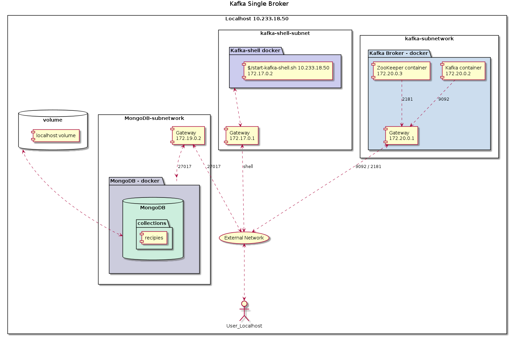

# Corriendo Kafka en Docker Containers

## Arquitectura de la solucion - Un solo nodo Kafka



#### PASO 1: Iniciar Kafka/Zookeeper Containers

Command: `docker-compose -f docker-compose-single-broker.yml up -d`

Este es el contenido del archivo docker-compose.yml que vamos a utilizar.  Verifique
que KAFKA_ADVERTISED_HOST_NAME corresponde a la direccion IP assignada a `en0`.  En
Mac, utilice el comando  `ipconfig getifaddr en0`, que regresara la direccion IP (en mi caso
10.233.18.50).  Edite el archivo y actualice el valor de la variable:

```yaml
$ cat docker-compose-single-broker.yml
# Docker-compose file for a single-broker
version: '2'
services:
  zookeeper:
    image: wurstmeister/zookeeper
    ports:
      - "2181:2181"
    expose:
      - "2181"
  kafka:
    build: .
    ports:
      - "9092:9092"
    expose:
      - "9092"
    environment:
      KAFKA_ADVERTISED_HOST_NAME: 10.233.18.50
      # KAFKA_ADVERTISED_HOST_NAME: 192.168.99.100
      # KAFKA_CREATE_TOPICS: "test:1:1"
      KAFKA_ZOOKEEPER_CONNECT: zookeeper:2181
    volumes:
      - /var/run/docker.sock:/var/run/docker.sock

```

#### PASO 2: Iniciar contendor kafka shell para interactuar con el broker
En este paso vamos a conectarnos a un contendor corriendo la imagen de kafka, y 
desde alli, vamos a crear un topico al que vamos a escribir desde un programa.

```bash
# Note que la direccion IP es el valor de KAFKA_ADVERTISED_HOST_NAME 
./start-kafka-shell.sh 10.232.36.22 

# En el nuevo shell - crear el topico "oztest" con 4 particiones
bash-4.4# kafka-topics.sh --create --topic oztest --partitions 4 --replication-factor 1 --bootstrap-server `broker-list.sh`

# Para borrar un topico
bash-4.4# kafka-topics.sh --delete --topic test --bootstrap-server `broker-list.sh`

# Descripcion de un topico
bash-4.4# kafka-topics.sh --describe --topic ozsample --bootstrap-server=`broker-list.sh`

Topic: ozsample	PartitionCount: 1	ReplicationFactor: 1	Configs: segment.bytes=1073741824
	Topic: ozsample	Partition: 0	Leader: 1005	Replicas: 1005	Isr: 1005

```

### PASO 3: Enviando mensajes desde Python usando libreria Kafka
Desde una terminal en "localhost"  cree un programa que envie datos al topico que creamos 
en el PASO 2.  

```python

# Programa: example-producer.py
#

from kafka import KafkaProducer
import time

mykafkaserver="localhost:9092"
mytopic="ozsample"

try:
   producer = KafkaProducer(bootstrap_servers=mykafkaserver)
except Exception as e:
   print ("Error conectandose a Kafka")
   print (e)

mymessage = ['Bienvenido','a Kafka','una aventura','en el manejo','de eventos']

key=1001
for m in mymessage:
    key = key + 1
    mkey = 'message-'+str(key)
    print ("sending ",mkey," = ",m)
    # message encoded to ensure valid unicode as expected by Kafka
    key_bytes = bytes(mkey, encoding='utf-8')
    value_bytes = bytes(m, encoding='utf-8')
    producer.send(mytopic, key=key_bytes, value=value_bytes)
    producer.flush()
    # delay introduced just for illustration purposes (not needed by Kakfa)
    time.sleep(1)

```

Al ejecutar este programa la salida debe ser algo asi.. 

```bash
# Ejecutando el programa
$ python example-producer.py

sending  message-1002  =  Bienvenido
sending  message-1003  =  a Kafka
sending  message-1004  =  una aventura
sending  message-1005  =  en el manejo
sending  message-1006  =  de eventos

```
### PASO 4: Leer mensajes publicados en Kafka desde localhost
En este paso vamos a leer los mensajes publicados en Kafka, en el topico "ozsample".  Para este 
ejercicio cree un programa en python y ejecutelo desde la terminal en localhost.
```python

# Programa Example-consumer.py
from kafka import KafkaConsumer

parsed_topic_name='oztest1'
try:
   consumer = KafkaConsumer(parsed_topic_name, auto_offset_reset='earliest',
                  bootstrap_servers=['localhost:9092'], api_version=(0, 10), consumer_timeout_ms=5000)
except Exception as e:
    print ("Error conectandose a Kafka")
    print (e)

# muestra mensajes y extrae el contenido
for message in consumer:
    print(message)
    # decodifica
    msg = bytes.decode(message.value)
    print("content: ", msg)

```
La ejecucion de este programa debe producir resultados como estos:

```
# desde la terminal en localhost


$ python example-consumer.py

ConsumerRecord(topic='oztest1', partition=0, offset=0, timestamp=1585103975358, timestamp_type=0, key=b'message-1006', value=b'de eventos', headers=[], checksum=2371263753, serialized_key_size=12, serialized_value_size=10, serialized_header_size=-1)
content:  de eventos

ConsumerRecord(topic='oztest1', partition=1, offset=0, timestamp=1585103971232, timestamp_type=0, key=b'message-1002', value=b'Bienvenido', headers=[], checksum=2170847914, serialized_key_size=12, serialized_value_size=10, serialized_header_size=-1)
content:  Bienvenido

ConsumerRecord(topic='oztest1', partition=1, offset=1, timestamp=1585103972253, timestamp_type=0, key=b'message-1003', value=b'a Kafka', headers=[], checksum=3311813990, serialized_key_size=12, serialized_value_size=7, serialized_header_size=-1)
content:  a Kafka

ConsumerRecord(topic='oztest1', partition=3, offset=0, timestamp=1585103973292, timestamp_type=0, key=b'message-1004', value=b'una aventura', headers=[], checksum=2442140435, serialized_key_size=12, serialized_value_size=12, serialized_header_size=-1)
content:  una aventura

ConsumerRecord(topic='oztest1', partition=3, offset=1, timestamp=1585103974330, timestamp_type=0, key=b'message-1005', value=b'en el manejo', headers=[], checksum=4053552911, serialized_key_size=12, serialized_value_size=12, serialized_header_size=-1)
content:  en el manejo


```


